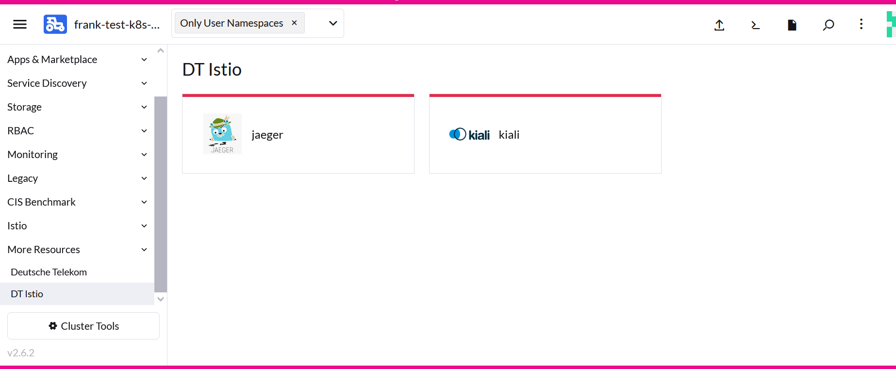
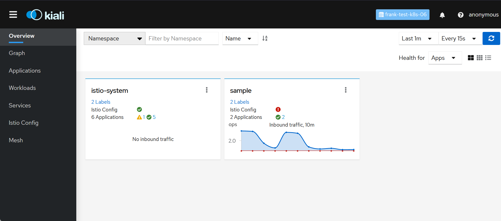
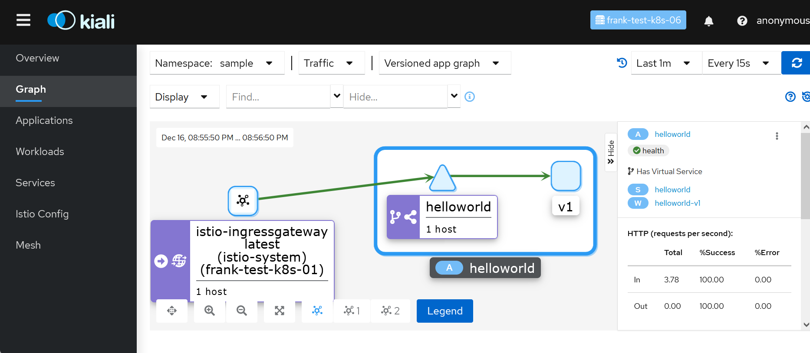
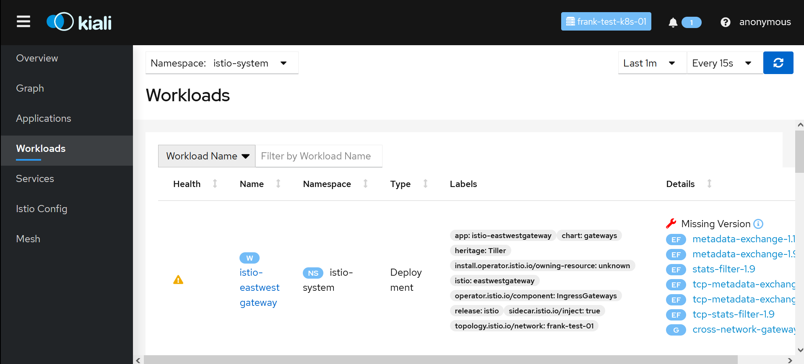
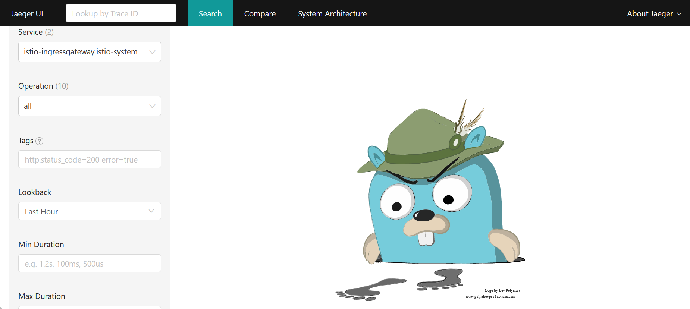
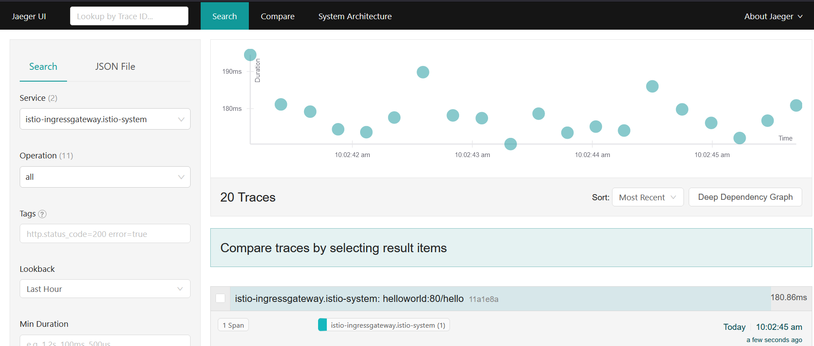
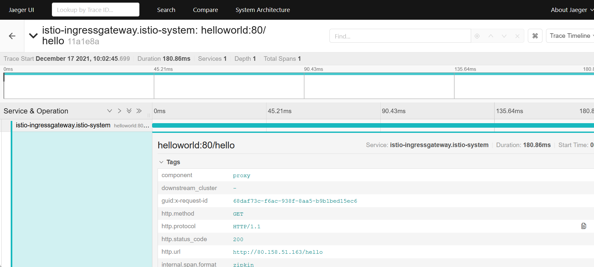
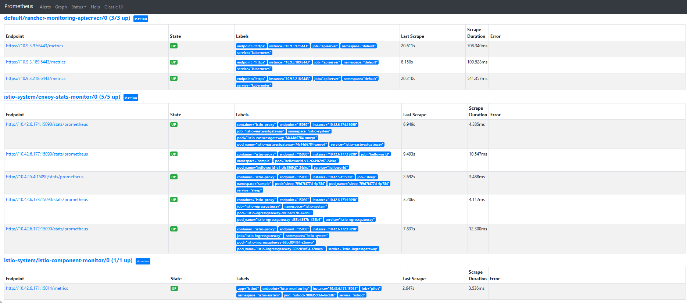
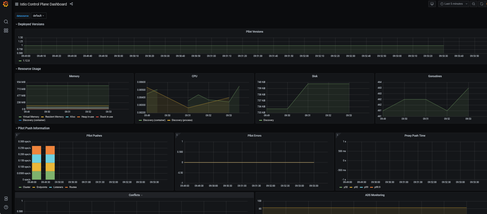

# Istio Day 2 Operations in Rancher

Prerequisites: Istio Multi-Cluster running in Rancher

## Kiali

[Kiali](https://kiali.io/) is a tool to manage, visualize, validate and troubleshoot 
your Service Mesh. Kiali provides like Istio 3 install methods:

* Install by Rancher as sub chart of rancher-istio
* Install by origin Kiali Helm Chart
* Install by Kiali Operator

Kiali is in heavy developement and with Rancher provided versions have
[bugs](https://github.com/kiali/kiali/issues/4132). For this reason we use the Rancher
Helm chart but latest version for installation on bothe clusters:

```yaml
cat << EOF > values-kiali.yaml
global:
  # Specify rancher clusterId of external tracing config
  # https://github.com/istio/istio.io/issues/4146#issuecomment-493543032
  cattle:
    systemDefaultRegistry: "mtr.external.otc.telekomcloud.com"
    clusterId: "c-pzk8b"
  rbac:
    pspEnabled: true

fullnameOverride: "kiali"

istio_namespace: "istio-system"

auth:
  strategy: anonymous

deployment:
  repository: istio/kiali
  image_pull_policy: "IfNotPresent"
  tag: v1.44
  accessible_namespaces:
  - "sample"
  - "istio-system"
  # - "**"

  ingress_enabled: false
  node_selector: {}
  resources:
    limits:
      cpu: 512m
      memory: 1024Mi
    requests:
      cpu: 10m
      memory: 128Mi

external_services:
  prometheus:
    custom_metrics_url: "http://rancher-monitoring-prometheus.cattle-monitoring-system.svc:9090"
    url: "http://rancher-monitoring-prometheus.cattle-monitoring-system.svc:9090"
  tracing:
    in_cluster_url: "http://tracing.istio-system.svc:16686/jaeger"
  grafana:
    in_cluster_url: "http://rancher-monitoring-grafana.cattle-monitoring-system.svc:80"
    url: "http://rancher-monitoring-grafana.cattle-monitoring-system.svc:80"

EOF
```

3 things are important here:

* as to see the cluster-id is set 
* only `istio-system` and `sample` namespace will discover (Kiali will have access the whole cluster)
* the internal monitoring endpoints will be used from rancher-monitoring

```bash
helm upgrade -i \
  --namespace istio-system \
  --repo https://charts.rancher.io \
  rancher-kiali-server-crd \
  rancher-kiali-server-crd

helm upgrade -i \
  --namespace istio-system \
  --repo https://charts.rancher.io \
  -f values-kiali.yaml \
  rancher-kiali-server \
  rancher-kiali-server
```

Within the provided credentials for remote Istio installations Kiali
will discover this endpoints as well. But multi-cluster feature is in
experimental state, don't expect too much. A very tiny bug is the API
endpoint port for the remote cluster. Read [this discussion](https://github.com/kiali/kiali/discussions/4595)
how to handle that.

Addionally we need NetworkPolicy to communicate with Istio, Jaeger, KubeAPI,
and Prometheus. Beware that ServiceEndpoints sometimes are on different port
as Service ports!

```yaml
cat <<EOF | kubectl -n istio-system apply -f -
apiVersion: networking.k8s.io/v1
kind: NetworkPolicy
metadata:
  annotations:
  name: np-kiali-ports
  namespace: istio-system
spec:
  egress:
  - ports:
    - port: 8080
      protocol: TCP
  - ports:
    - port: 8081
      protocol: TCP
  - ports:
    - port: 9090
      protocol: TCP
  - ports:
    - port: 16686
      protocol: TCP
  ingress:
  - ports:
    - port: 16686
      protocol: TCP
  - ports:
    - port: 8080
      protocol: TCP
  podSelector: {}
  policyTypes:
  - Egress
  - Ingress
EOF
```

## Jaeger

[Jaeger](https://www.jaegertracing.io/) monitor and troubleshoot transaction in
distributed systems. Jaeger is a very powerful tool which can configure with
Cassandra, Elasticsearch or Kafka Cluster. It would be an extra project to
install Jaeger with such kind of sizing. There is also a "all-in-one" installation
which will we use here.

```yaml
cat << EOF > values-jaeger.yaml
provider: jaeger

global:
  cattle:
    systemDefaultRegistry: "mtr.external.otc.telekomcloud.com"
  defaultResources: {}
  imagePullPolicy: IfNotPresent
  defaultNodeSelector: {}
  rbac:
    pspEnabled: true

jaeger:
  contextPath: "/jaeger"
  repository: rancher/mirrored-jaegertracing-all-in-one
  tag: 1.20.0
  # spanStorageType value can be "memory" and "badger" for all-in-one image
  spanStorageType: badger
  resources:
    limits:
      cpu: 512m
      memory: 1024Mi
    requests:
      cpu: 10m
      memory: 128Mi
  persistentVolumeClaim:
    enabled: true
    storage: 5Gi
  storageClassName: "sata"
  accessMode: ReadWriteOnce
  memory:
    max_traces: 50000
zipkin:
  queryPort: 9411
service:
  annotations: {}
  name: http-query
  type: ClusterIP
  externalPort: 16686
EOF
```

We use a small PersistentVolumeClaim from StorageClass "sata". Adjust on your
own if you have other storage solutions. PVC can also disabled.

```bash
helm upgrade -i \
  --namespace istio-system \
  --repo https://charts.rancher.io \
  -f values-jaeger.yaml \
  rancher-tracing \
  rancher-tracing
```

```bash
$ helm -n istio-system list
NAME                            NAMESPACE       REVISION        UPDATED                                 STATUS          CHART                                         APP VERSION
rancher-kiali-server            istio-system    2               2021-12-13 19:32:43.792355775 +0100 CET deployed        rancher-kiali-server-100.0.0+up1.35.0         v1.35.0
rancher-kiali-server-crd        istio-system    2               2021-12-13 19:32:34.030428289 +0100 CET deployed        rancher-kiali-server-crd-100.0.0+up1.35.0
rancher-tracing                 istio-system    1               2021-12-13 19:27:56.874765051 +0100 CET deployed        rancher-tracing-100.0.0                       1.20.0
```

```bash
$ kubectl -n istio-system get pods
NAME                                     READY   STATUS    RESTARTS   AGE
istio-eastwestgateway-74c44d6784-xmvpt   1/1     Running   0          3d15h
istio-egressgateway-d85b4897b-478b6      1/1     Running   0          3d15h
istio-ingressgateway-66bc894f64-s2mwp    1/1     Running   0          3d15h
istiod-7f88d59c66-ksddb                  1/1     Running   1          3d15h
kiali-856478fc5c-45j59                   1/1     Running   0          45h
rancher-tracing-7fdfd977c5-cld45         1/1     Running   0          3d15h

$ kubectl -n istio-system get service
NAME                    TYPE           CLUSTER-IP      EXTERNAL-IP     PORT(S)                                                                      AGE
istio-eastwestgateway   LoadBalancer   10.43.237.208   80.158.38.107   15021:31548/TCP,15443:31645/TCP,15012:31299/TCP,15017:32553/TCP              22h
istio-egressgateway     ClusterIP      10.43.123.134   <none>          80/TCP,443/TCP
                      22h
istio-ingressgateway    LoadBalancer   10.43.234.25    80.158.47.22    15021:32029/TCP,80:30040/TCP,443:30229/TCP,31400:32720/TCP,15443:30421/TCP   22h
istiod                  ClusterIP      10.43.139.98    <none>          15010/TCP,15012/TCP,443/TCP,15014/TCP
                      3d15h
jaeger-collector        ClusterIP      10.43.204.140   <none>          14268/TCP,14250/TCP
                      3d15h
kiali                   ClusterIP      10.43.153.135   <none>          20001/TCP,9090/TCP
                      3d15h
tracing                 ClusterIP      10.43.81.211    <none>          16686/TCP
                      3d15h
zipkin                  ClusterIP      10.43.225.132   <none>          9411/TCP
                      3d15h

```

After that we have both application running with exposed internal services.
With Rancher proxy it can be reached with

[https://raseed-test.external.otc.telekomcloud.com/k8s/clusters/c-pzk8b/api/v1/namespaces/istio-system/services/http:tracing:16686/proxy/jaeger/](https://raseed-test.external.otc.telekomcloud.com/k8s/clusters/c-pzk8b/api/v1/namespaces/istio-system/services/http:tracing:16686/proxy/jaeger/) and
[https://raseed-test.external.otc.telekomcloud.com/k8s/clusters/c-pzk8b/api/v1/namespaces/istio-system/services/http:kiali:20001/proxy/](https://raseed-test.external.otc.telekomcloud.com/k8s/clusters/c-pzk8b/api/v1/namespaces/istio-system/services/http:kiali:20001/proxy/) on both cluster.

Not very common. Rancher 2.6 provides NavLinks resources to extend the
dashboard menu in the UI

```bash
kubectl apply -f https://raw.githubusercontent.com/mcsps/use-cases/master/istio/navlinks.yaml
```



UI views:

Kiali verified your Istio installation, shows problems and errors. At the end traffic flows
are shown in graphs, requests are listed in details.





Data are provided by Jaeger which logs requests and network traffic in detail,
based on the source interface and the commands.





## Prometheus

In Istio are already endpoints provided for scraping metrics.
All what we need are network access (already provided in
NetworkPolicy) and ServiceMonitor (when Prometheus Operator is
installed from rancher-monitoring)

### Service Monitor

```yaml
cat <<EOF | kubectl -n istio-system apply -f -
apiVersion: monitoring.coreos.com/v1
kind: ServiceMonitor
metadata:
  name: envoy-stats-monitor
  labels:
    monitoring: istio-proxies
spec:
  selector:
    matchExpressions:
    - {key: istio-prometheus-ignore, operator: DoesNotExist}
  namespaceSelector:
    any: true
  jobLabel: envoy-stats
  endpoints:
  - path: /stats/prometheus
    targetPort: 15090
    interval: 15s
    relabelings:
    - sourceLabels: [__meta_kubernetes_pod_container_port_name]
      action: keep
      regex: '.*-envoy-prom'
    - action: labeldrop
      regex: "__meta_kubernetes_pod_label_(.+)"
    - sourceLabels: [__meta_kubernetes_namespace]
      action: replace
      targetLabel: namespace
    - sourceLabels: [__meta_kubernetes_pod_name]
      action: replace
      targetLabel: pod_name
---
apiVersion: monitoring.coreos.com/v1
kind: ServiceMonitor
metadata:
  name: istio-component-monitor
  labels:
    monitoring: istio-components
spec:
  jobLabel: istio
  targetLabels: [app]
  selector:
    matchExpressions:
    - {key: istio, operator: In, values: [pilot]}
  namespaceSelector:
    any: true
  endpoints:
  - port: http-monitoring
    interval: 15s
```

```bash
$ kubectl -n istio-system get servicemonitors.monitoring.coreos.com
NAME                      AGE
envoy-stats-monitor       3d11h
istio-component-monitor   3d11h
```

### Service Endpoints



## Grafana

There are many Grafana dashboard available for Istio. Want to mention here
the [Istio Control Plan Dashboard](https://grafana.com/grafana/dashboards/7645)
which works out of the box. Easy to add as explained in [Rancher Docs](https://rancher.com/docs/rancher/v2.5/en/monitoring-alerting/guides/customize-grafana/):




Happy [Istio!](https://istio.io/)

