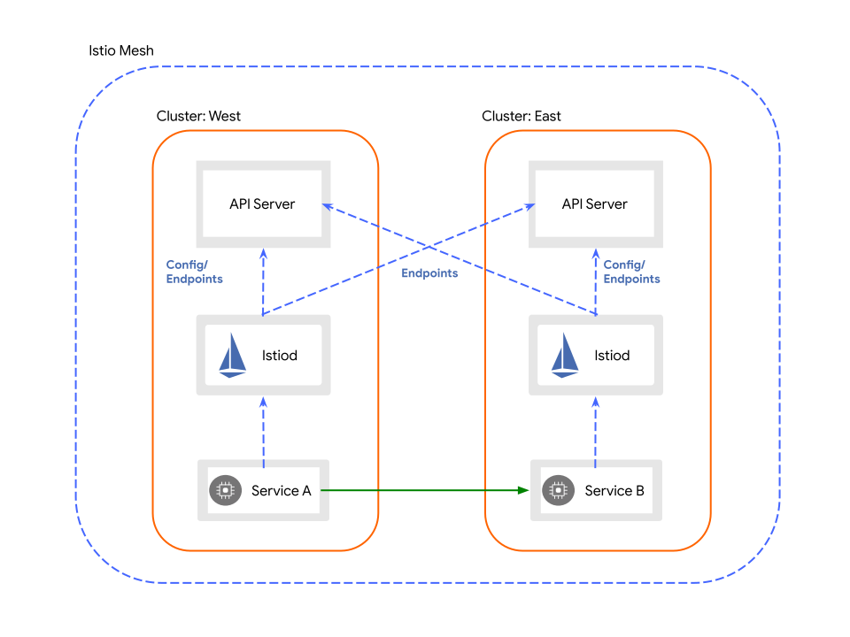

# Kubernetes Multicluster in Rancher with Istio

A Service Mesh describes a functionality to mixup services in different versions or
locations. Istio is one of the Service Mesh which we want to discover and to solve
problems like

* cluster-redundancy (each Kubernetes cluster works independent from each other and
serve cloud-native, business-critical applications)
* geo-redundancy (don't spread one cluster in different locations, each one location
per cluster)
* traffic shifting (serve one version of an application to one specific part of your
customer, based on a region or your test team)

Hint: There are already technical solutions to solve the problems with Kubernetes tools
and without a Service Mesh, because you load a lots of technical dependencies.

Let's start!

## Prerequisites

* 2 Kubernetes Downstream Cluster (1.20.12-rancher1-1) managed by Rancher
* Cluster Admin access to Rancher
* Possibility to deploy External Loadbalancer, i.e. OTC ELB with [OpenStack Cloud Controller Manager](github.com/kubernetes/cloud-provider-openstack)

The cluster fullfil the [CIS Benchmark Check](https://rancher.com/docs/rancher/v2.6/en/cis-scans/)

* `restricted` PodSecurityPolicy is enforced
* ProjectNetworkIsolation is enabled


## More Prerequisites

* Istio images are mirrored to MTR. Check available versions on https://mtr.devops.telekom.de/repository/istio/
* Download kubectl (if required) and get kube-config from Rancher

```bash
curl -LO https://storage.googleapis.com/kubernetes-release/release/$(curl -s https://storage.googleapis.com/kubernetes-release/release/stable.txt)/bin/linux/amd64/kubectl
```

* Download and install istioctl:

```bash
$ curl -L https://istio.io/downloadIstio | sh -
```

## Istio install methods & project goal

* Install by Rancher App Catalog (Rancher Helm Chart)
* Install by origin Istio Helm Chart
* Install by Istio Operator

We will use Istio Operator to verify each step to install Istio version
1.12.0 (lower versions might have problems with the multi-cluster connect)

Project goal is to install [Istio Helloworld Example](https://github.com/istio/istio/tree/master/samples/helloworld)
on both cluster and make a traffic shifting. Target picture looks like that:



* The HelloWorld service in both cluster
* Exposed Ingress service
* Eastwest Gateway for interconnect traffic

## Cluster preparation

Assumption:

| No | Name             | ID       | Network       | Mesh       |
|----|------------------|----------|---------------|------------|
| 1  |mcsps-test-k8s-01 |  c-f7r9g | mcsps-test-01 | mcsps-test |
| 2  |mcsps-test-k8s-02 |  c-pzk8b | mcsps-test-02 | mcsps-test |


Create a project `istio` for both cluster in Rancher context:

```yaml
cat <<EOF | kubectl -n c-f7r9g apply -f -
apiVersion: management.cattle.io/v3
kind: Project
metadata:
  name: istio
spec:
  clusterName: c-f7r9g
  containerDefaultResourceLimit:
    limitsCpu: 200m
    limitsMemory: 128Mi
    requestsCpu: 100m
    requestsMemory: 64Mi
  description: Istio Manage Project
  displayName: istio
  enableProjectMonitoring: false
  namespaceDefaultResourceQuota:
    limit:
      limitsCpu: "12000m"
      limitsMemory: "12000Mi"
  resourceQuota:
    limit:
      limitsCpu: "12000m"
      limitsMemory: "12000Mi"
EOF
```

Create a namespace `istio-system` on both cluster in Cluster context:

```yaml
cat <<EOF | kubectl apply -f -
apiVersion: v1
kind: Namespace
metadata:
  annotations:
    field.cattle.io/projectId: c-pzk8b:istio
    field.cattle.io/resourceQuota: '{"limit":{"limitsCpu":"12000m","limitsMemory":"12000Mi"}}'
    lifecycle.cattle.io/create.namespace-auth: "true"
    scheduler.alpha.kubernetes.io/node-selector: role=ingress
  labels:
    field.cattle.io/projectId: istio
    topology.istio.io/network: mcsps-test-01
  name: istio-system
EOF
```
* There is the assumption that we have worker nodes for Ingress with role `ingress`. Otherwise
remove this annotation.
* Ensure the right cluster-id and network-id

Create LimitRange in `istio-system` namespace for container default quota:

```yaml
cat <<EOF | kubectl apply -f -
apiVersion: v1
kind: LimitRange
metadata:
  labels:
    resourcequota.management.cattle.io/default-resource-quota: "true"
  name: istio-limitrange
  namespace: istio-system
spec:
  limits:
  - default:
      cpu: 100m
      memory: 100Mi
    defaultRequest:
      cpu: 10m
      memory: 10Mi
    type: Container
EOF
```
Create a namespace `sample` on both cluster in Cluster context:

```bash
$ kubectl create namespace sample
$ kubectl label namespace sample  istio-injection=enabled --overwrite
```

## Istio Operator installation

```
$ istioctl operator init --tag 1.12.0 --hub mtr.devops.telekom.de/istio
```

This will install the Istio Operator in namespace `istio-operator`

## Multi-Cluster preparation

There are some tasks mentioned in [Istio Documentation](https://istio.io/latest/docs/setup/install/multicluster/before-you-begin/) like `Configure Trust`. This step has also an [example](https://github.com/istio/istio/tree/master/samples/certs)

In sample/certs folder:
```
make -f ../tools/certs/Makefile.selfsigned.mk root-ca
make -f ../tools/certs/Makefile.selfsigned.mk mcsps-test-k8s-01-cacerts
make -f ../tools/certs/Makefile.selfsigned.mk mcsps-test-k8s-02-cacerts
```

Apply to the cluster (with context cluster 01):

```
./mcsps-test-k8s-01.sh
```

Apply to the cluster (with context cluster 02):

```
./mcsps-test-k8s-02.sh
```

Check generated secrets

```bash
kubectl -n istio-system get secrets cacerts
cacerts                                            Opaque                                4      57d
```

Create a Rancher Token with scope on cluster1 and cluster2, create a kube-config
file like this example and encode this with `base64`

```yaml
cat <<EOF | base64 -w0
apiVersion: v1
clusters:
- cluster:
    server: https://raseed-test.external.otc.telekomcloud.com/k8s/clusters/c-f7r9g
  name: mcsps-test-k8s-01
contexts:
- context:
    cluster: mcsps-test-k8s-01
    user: mcsps-test-k8s-01
  name: mcsps-test-k8s-01
current-context: mcsps-test-k8s-01
kind: Config
preferences: {}
users:
- name: mcsps-test-k8s-01
  user:
    token: token-hfjvg:tsjn2k5vlvjjzqhwpbpzwfkb549q54pdxrksfn6hw82svbq5vcgrml
EOF
```

Create a remote secret with the base64 content with the credentials and the name of other cluster.
For example apply this secret on cluster2:

```yaml
cat <<EOF | kubectl -n istio-system apply -f -
apiVersion: v1
data:
  mcsps-test-k8s-01: YXBpVmVyc2lvbjogdjEKY2x1c3RlcnM6Ci0gY2x1c3RlcjoKICAgIHNlcnZlcjogaHR0cHM6Ly9yYXNlZWQtdGVzdC5leHRlcm5hbC5vdGMudGVsZWtvbWNsb3VkLmNvbS9rOHMvY2x1c3RlcnMvYy1mN3I5ZwogIG5hbWU6IG1jc3BzLXRlc3QtazhzLTAxCmNvbnRleHRzOgotIGNvbnRleHQ6CiAgICBjbHVzdGVyOiBtY3Nwcy10ZXN0LWs4cy0wMQogICAgdXNlcjogbWNzcHMtdGVzdC1rOHMtMDEKICBuYW1lOiBtY3Nwcy10ZXN0LWs4cy0wMQpjdXJyZW50LWNvbnRleHQ6IG1jc3BzLXRlc3QtazhzLTAxCmtpbmQ6IENvbmZpZwpwcmVmZXJlbmNlczoge30KdXNlcnM6Ci0gbmFtZTogbWNzcHMtdGVzdC1rOHMtMDEKICB1c2VyOgogICAgdG9rZW46IHRva2VuLWhmanZnOnRzam4yazV2bHZqanpxaHdwYnB6d2ZrYjU0OXE1NHBkeHJrc2ZuNmh3ODJzdmJxNXZjZ3JtbAo=
kind: Secret
metadata:
  annotations:
    networking.istio.io/cluster: mcsps-test-k8s-01
  labels:
    istio/multiCluster: "true"
  name: istio-remote-secret-mcsps-test-k8s-01
  namespace: istio-system
type: Opaque
EOF
```

Verify remote secret on each cluster:

```bash
kubectl -n istio-system get secrets | grep remote-secret
istio-remote-secret-mcsps-test-k8s-01              Opaque                                1      57d
```

hint: there is another option to generate remote secret with
certificates, but it's only named here:

```bash
istioctl x create-remote-secret \
    --name=mcsps-test-k8s-01 --context=mcsps-test-k8s-01
```

## Install Istio Controlplane and Istio Ingressgateway

Now we will install Istio Controllplane on each cluster:

```yaml
cat <<EOF | kubectl -n istio-system apply -f -
apiVersion: install.istio.io/v1alpha1
kind: IstioOperator
metadata:
  name: mcsps-test
  namespace: istio-system
spec:
  tag: 1.12.0
  profile: demo
  hub: mtr.devops.telekom.de/istio
  values:
    global:
      meshID: mcsps-test
      multiCluster:
        clusterName: mcsps-test-k8s-01
        enabled: true
      network: mcsps-test-01
EOF
```

## Install Istio Eastwestgateway

Install Easwestgateway on each cluster:

```yaml
cat <<EOF | kubectl -n istio-system apply -f -
apiVersion: install.istio.io/v1alpha1
kind: IstioOperator
metadata:
  name: eastwest
spec:
  tag: 1.12.0
  hub: mtr.devops.telekom.de/istio
  revision: ""
  profile: empty
  components:
    ingressGateways:
      - name: istio-eastwestgateway
        label:
          istio: eastwestgateway
          app: istio-eastwestgateway
          topology.istio.io/network: mcsps-test-01
        enabled: true
        k8s:
          env:
            - name: ISTIO_META_REQUESTED_NETWORK_VIEW
              value: mcsps-test-01
          service:
            ports:
              - name: status-port
                port: 15021
                targetPort: 15021
              - name: tls
                port: 15443
                targetPort: 15443
              - name: tls-istiod
                port: 15012
                targetPort: 15012
              - name: tls-webhook
                port: 15017
                targetPort: 15017
  values:
    gateways:
      istio-ingressgateway:
        injectionTemplate: gateway
    global:
      network: mcsps-test-01
EOF
```

## Expose Istio Service

Expose mTLS service on each cluster:

```yaml
cat <<EOF | kubectl -n istio-system apply -f -
apiVersion: networking.istio.io/v1alpha3
kind: Gateway
metadata:
  name: cross-network-gateway
spec:
  selector:
    istio: eastwestgateway
  servers:
    - port:
        number: 15443
        name: tls
        protocol: TLS
      tls:
        mode: AUTO_PASSTHROUGH
      hosts:
        - "*.local"
EOF
```

## Verify Istio Controllplane and Gateways

```bash
$ kubectl -n istio-system get all
NAME                                         READY   STATUS    RESTARTS   AGE
pod/istio-eastwestgateway-75584d6b7d-qpnn2   1/1     Running   0          22h
pod/istio-egressgateway-74844b98b7-k4bp9     1/1     Running   0          22h
pod/istio-ingressgateway-88854fd9d-c2kbm     1/1     Running   0          22h
pod/istiod-55f8ddf47f-hgvps                  1/1     Running   0          22h

NAME                            TYPE           CLUSTER-IP      EXTERNAL-IP     PORT(S)
                              AGE
service/istio-eastwestgateway   LoadBalancer   10.43.237.208   80.158.38.107   15021:31548/TCP,15443:31645/TCP,15012:31299/TCP,15017:32553/TCP              22h
service/istio-egressgateway     ClusterIP      10.43.123.134   <none>          80/TCP,443/TCP
                              22h
service/istio-ingressgateway    LoadBalancer   10.43.234.25    80.158.47.22    15021:32029/TCP,80:30040/TCP,443:30229/TCP,31400:32720/TCP,15443:30421/TCP   22h
service/istiod                  ClusterIP      10.43.139.98    <none>          15010/TCP,15012/TCP,443/TCP,15014/TCP
                              22h

NAME                                    READY   UP-TO-DATE   AVAILABLE   AGE
deployment.apps/istio-eastwestgateway   1/1     1            1           22h
deployment.apps/istio-egressgateway     1/1     1            1           22h
deployment.apps/istio-ingressgateway    1/1     1            1           22h
deployment.apps/istiod                  1/1     1            1           22h

NAME                                               DESIRED   CURRENT   READY   AGE
replicaset.apps/istio-eastwestgateway-75584d6b7d   1         1         1       22h
replicaset.apps/istio-egressgateway-74844b98b7     1         1         1       22h
replicaset.apps/istio-egressgateway-f994cbcf8      0         0         0       22h
replicaset.apps/istio-ingressgateway-88854fd9d     1         1         1       22h
replicaset.apps/istiod-55f8ddf47f                  1         1         1       22h

NAME                                                        REFERENCE                          TARGETS   MINPODS   MAXPODS   REPLICAS   AGE
horizontalpodautoscaler.autoscaling/istio-eastwestgateway   Deployment/istio-eastwestgateway   18%/80%   1         5         1          22h
```

If istiod won't start due the cluster permissions adjust the clusterrole:

Fix ClusterRole in Istio 1.12.0

```bash
$ kubectl edit  clusterrole istiod-istio-system
# verify/add
- apiGroups:
  - extensions.istio.io
  resources:
  - wasmplugins
  verbs:
  - get
  - watch
  - list
```

```bash
$ kubectl -n istio-system get istiooperators.install.istio.io
NAME         REVISION   STATUS    AGE
eastwest                HEALTHY   22h
mcsps-test              HEALTHY   22h
```

```bash
$ kubectl -n istio-system get gateways.networking.istio.io
NAME                    AGE
cross-network-gateway   22h
```

## Install Helloworld

hint: origin samples are in the Istio Github Repo: https://github.com/istio/istio/tree/master/samples/helloworld

cluster1:

deploy v1

```bash
kubectl -n sample apply -f https://raw.githubusercontent.com/mcsps/use-cases/master/istio/helloworld.yaml -l version=v1
kubectl -n sample apply -f https://raw.githubusercontent.com/mcsps/use-cases/master/istio/helloworld.yaml -l service=helloworld
kubectl -n sample apply -f https://raw.githubusercontent.com/mcsps/use-cases/master/istio/helloworld-gateway.yaml
```

cluster2:

deploy v2

```bash
kubectl -n sample apply -f https://raw.githubusercontent.com/mcsps/use-cases/master/istio/helloworld.yaml -l version=v2
kubectl -n sample apply -f https://raw.githubusercontent.com/mcsps/use-cases/master/istio/helloworld.yaml -l service=helloworld
kubectl -n sample apply -f https://raw.githubusercontent.com/mcsps/use-cases/master/istio/helloworld-gateway.yaml
```

## Adjust NetworkPolicy

Istio and Rancher applied already some NetworkPolicy rules:

```bash
$ kubectl -n sample get networkpolicies.networking.k8s.io
NAME            POD-SELECTOR     AGE
hn-nodes        <none>           32h
np-default      <none>           32h

$ kubectl -n istio-system get networkpolicies.networking.k8s.io
NAME                       POD-SELECTOR                                                                              AGE
hn-nodes                   <none>                                                                                    29h
np-default                 <none>                                                                                    29h
np-istio-eastwestgateway   app=istio-eastwestgateway,istio=eastwestgateway,topology.istio.io/network=mcsps-test-01   29h
np-istio-ingressgateway    app=istio-ingressgateway,istio=ingressgateway                                             29h
```

Rancher default rules are fine for "normal" communication on Overlay Network or Ingress on the same cluster.

For our Helloworld app we have to define allowed communication on both cluster:

This rule should allow all traffic from and to namespaces where `istio-injection` is set:

```yaml
cat <<EOF | kubectl -n istio-system apply -f -
apiVersion: networking.k8s.io/v1
kind: NetworkPolicy
metadata:
  name: np-istio
spec:
  egress:
  - to:
    - namespaceSelector:
        matchLabels:
          istio-injection: enabled
  ingress:
  - from:
    - namespaceSelector:
        matchLabels:
          istio-injection: enabled
  podSelector: {}
  policyTypes:
  - Egress
  - Ingress
EOF
```

With this rule we allow explicit traffic from and to Istio service ports, Kube-API and kube-dns:


```yaml
cat <<EOF | kubectl -n istio-system apply -f -
apiVersion: networking.k8s.io/v1
kind: NetworkPolicy
metadata:
  annotations:
  name: np-istio-ports
  namespace: istio-system
spec:
  egress:
  - ports:
    - port: 15010
      protocol: TCP
  - ports:
    - port: 15012
      protocol: TCP
  - ports:
    - port: 15014
      protocol: TCP
  - ports:
    - port: 15017
      protocol: TCP
  - ports:
    - port: 15443
      protocol: TCP
  - ports:
    - port: 6443
      protocol: TCP
  - ports:
    - port: 80
      protocol: TCP
  - ports:
    - port: 53
      protocol: TCP
  - ports:
    - port: 53
      protocol: UDP
  ingress:
  - ports:
    - port: 80
      protocol: TCP
  - ports:
    - port: 15010
      protocol: TCP
  - ports:
    - port: 15012
      protocol: TCP
  - ports:
    - port: 15014
      protocol: TCP
  - ports:
    - port: 15017
      protocol: TCP
  - ports:
    - port: 15443
      protocol: TCP
  podSelector: {}
  policyTypes:
  - Egress
  - Ingress
EOF
```

At the end we allow in our app also traffic to Istio service, kube-dns, and of course the service port,
where Helloworld is served:

```yaml
cat <<EOF | kubectl -n sample apply -f -
apiVersion: networking.k8s.io/v1
kind: NetworkPolicy
metadata:
  annotations:
  name: np-helloworld
spec:
  egress:
  - ports:
    - port: 5000
      protocol: TCP
  - ports:
    - port: 15012
      protocol: TCP
  - ports:
    - port: 53
      protocol: UDP
  ingress:
  - ports:
    - port: 5000
      protocol: TCP
  - ports:
    - port: 15012
      protocol: TCP
  podSelector:
    matchLabels:
      app: helloworld
  policyTypes:
  - Egress
  - Ingress
EOF
```

## Verifiy Installation (troubleshooting guide)

verify eastwest traffic

```bash
$ istioctl -n sample proxy-config endpoint helloworld-v2-5866f57dd6-8hgml| grep helloworld
10.42.6.65:5000                  HEALTHY     OK                outbound|5000|v2|helloworld.sample.svc.cluster.local
10.42.6.65:5000                  HEALTHY     OK                outbound|5000||helloworld.sample.svc.cluster.local
80.158.16.72:15443               HEALTHY     OK                outbound|5000|v1|helloworld.sample.svc.cluster.local
80.158.16.72:15443               HEALTHY     OK                outbound|5000||helloworld.sample.svc.cluster.local
```

In case of working eastwest gateway you should see as endpoint of the remote cluster the LoadBalancer ip-address
and the mTLS port 15443 here. Without eastwest the POD-IP of each helloworld pod will appear (which is not available)

```bash
$ for i in {1..12}; do curl http://80.158.47.22/hello;sleep 1;done
Hello version: v2, instance: helloworld-v2-5866f57dd6-8hgml
Hello version: v1, instance: helloworld-v1-c6c4969d7-lfgw7
Hello version: v2, instance: helloworld-v2-5866f57dd6-8hgml
Hello version: v1, instance: helloworld-v1-c6c4969d7-lfgw7
Hello version: v2, instance: helloworld-v2-5866f57dd6-8hgml
Hello version: v2, instance: helloworld-v2-5866f57dd6-8hgml
Hello version: v1, instance: helloworld-v1-c6c4969d7-lfgw7
Hello version: v2, instance: helloworld-v2-5866f57dd6-8hgml
Hello version: v1, instance: helloworld-v1-c6c4969d7-lfgw7
Hello version: v2, instance: helloworld-v2-5866f57dd6-8hgml
Hello version: v1, instance: helloworld-v1-c6c4969d7-lfgw7
Hello version: v2, instance: helloworld-v2-5866f57dd6-8hgml
```

The Istio project collected information in a [Troubleshooting Guide](https://istio.io/latest/docs/ops/common-problems/network-issues/)

## Traffic shifting

To get some order in the Helloworld traffic management we decide
which version is running on which endpoint:

```yaml
cat <<EOF | kubectl -n sample apply -f -
apiVersion: networking.istio.io/v1alpha3
kind: DestinationRule
metadata:
  name: helloworld
spec:
  host: helloworld
  subsets:
  - name: v1
    labels:
      version: v1
  - name: v2
    labels:
      version: v2
```

Now we can say, 90% of traffic served by one services, and 10% by the other:

```yaml
cat <<EOF | kubectl -n sample apply -f -
apiVersion: networking.istio.io/v1beta1
kind: VirtualService
metadata:
  name: helloworld
spec:
  gateways:
  - helloworld-gateway
  hosts:
  - '*'
  http:
  - match:
    - uri:
        exact: /hello
    route:
    - destination:
        host: helloworld
        port:
          number: 5000
        subset: v1
      weight: 10
    - destination:
        host: helloworld
        port:
          number: 5000
        subset: v2
      weight: 90
```

Don't forget to apply this in both cluster to manage both Ingress
with the same configuration. Now we should see more v2 versions
in reply loop:

```bash
$ for i in {1..12}; do curl http://80.158.47.22/hello;sleep 1;done
Hello version: v2, instance: helloworld-v2-5866f57dd6-8hgml
Hello version: v2, instance: helloworld-v2-5866f57dd6-8hgml
Hello version: v2, instance: helloworld-v2-5866f57dd6-8hgml
Hello version: v1, instance: helloworld-v1-c6c4969d7-lfgw7
Hello version: v2, instance: helloworld-v2-5866f57dd6-8hgml
Hello version: v1, instance: helloworld-v1-c6c4969d7-lfgw7
Hello version: v2, instance: helloworld-v2-5866f57dd6-8hgml
Hello version: v2, instance: helloworld-v2-5866f57dd6-8hgml
Hello version: v2, instance: helloworld-v2-5866f57dd6-8hgml
Hello version: v2, instance: helloworld-v2-5866f57dd6-8hgml
Hello version: v2, instance: helloworld-v2-5866f57dd6-8hgml
Hello version: v2, instance: helloworld-v2-5866f57dd6-8hgml
```

## SSL Frontend with Let's Encrypt Certification

Be more production-ready we want to use SSL termination on frontend,
a self-managed Let's Encrypt certificate together with a common hostname.

To start with the hostname issue we use already [External-DNS](https://github.com/kubernetes-sigs/external-dns)
and need to extend source list where external-dns listen on annotations:

```yaml
  - args:
    - --log-level=info
    - --log-format=text
    - --domain-filter=mcsps.telekomcloud.com
    - --policy=sync
    - --provider=designate
    - --registry=txt
    - --interval=1m
    - --txt-owner-id=$(K8S_NAME)
    - --txt-prefix=_$(K8S_NAME)_
    - --source=service
    - --source=ingress
    - --source=istio-gateway
```

Furthermore there is an issue that cert-manager with Istio can't operate
in the user namespace where the application lives (`sample`). 

"The Certificate should be created in the same namespace as the istio-ingressgateway"

Ref: https://istio.io/latest/docs/ops/integrations/certmanager/

This might be the decision that the Cluster Admin is responsible for this
task and not the user without permissions to the Istio project in Rancher.

Create a Gateway for SSL termination

```yaml
cat <<EOF | kubectl -n istio-system apply -f -
apiVersion: networking.istio.io/v1alpha3
kind: Gateway
metadata:
  annotations:
    external-dns.alpha.kubernetes.io/target: 80.158.47.22
  name: helloworld-ssl-gateway
spec:
  selector:
    istio: ingressgateway
  servers:
  - port:
      number: 443
      name: https
      protocol: HTTPS
    tls:
      mode: SIMPLE
      credentialName: helloistio-mcsps-telekomcloud-com
    hosts:
    - helloistio.mcsps.telekomcloud.com
```

The DNS target ist the ip-address of the IngressGateway
hint: to communicate with external-dns webhook we need a
NetworkPolicy Egress tcp/80 rule.

Create the VirtualService for traffic routing to the helloworld app
in the sample namespace:

```yaml
cat <<EOF | kubectl -n istio-system apply -f -
apiVersion: networking.istio.io/v1beta1
kind: VirtualService
metadata:
  annotations:
  name: helloworld-ssl
spec:
  gateways:
  - helloworld-ssl-gateway
  hosts:
  - '*'
  http:
  - match:
    - uri:
        exact: /hello
    route:
    - destination:
        host: helloworld.sample.svc.cluster.local
        port:
          number: 5000
        subset: v1
      weight: 90
    - destination:
        host: helloworld.sample.svc.cluster.local
        port:
          number: 5000
        subset: v2
      weight: 10

```

Create a certificate for helloworld:

```yaml
cat <<EOF | kubectl -n istio-system apply -f -
apiVersion: cert-manager.io/v1
kind: Certificate
metadata:
  name: helloistio
spec:
  issuerRef:
    group: cert-manager.io
    kind: ClusterIssuer
    name: letsencrypt-wild
  secretName: helloistio-mcsps-telekomcloud-com
  commonName: helloistio.mcsps.telekomcloud.com
  dnsNames:
  - helloistio.mcsps.telekomcloud.com
```

There are the assumption we have a ClusterIssuer `letsencrypt-wild` with
dns01-challenge and a Designate-managed domain because we use external-dns.

```yaml
apiVersion: cert-manager.io/v1
kind: ClusterIssuer
metadata:
  name: letsencrypt-wild
spec:
  acme:
    email: cloud-operations@telekom.de
    preferredChain: ""
    privateKeySecretRef:
      name: letsencrypt-wild
    server: https://acme-v02.api.letsencrypt.org/directory
    solvers:
    - dns01:
        webhook:
          groupName: acme.syseleven.de
          solverName: designatedns
```

Let`s Encrypt http-01 challenge will not work out of the box with
Istio because this challenge expects temporary Ingress defintions.

You will see something like that on IngressGateway:

```bash
[2021-12-11T17:40:54.432Z] "GET /.well-known/acme-challenge/Q14PwTatb9y3RPS3o4jss2NQL5lioZTnevB4kI7lns44 HTTP/1.1" 404 NR route_not_found - "-" 0 0 0 - "10.42.7.0" "cert-manager/v1.5.3 (clean)" "4828cac7-ae2d-91e7-9699-a6c2e9a82321" "helloistio.mcsps.telekomcloud.com" "-" - - 10.42.6.79:8080 10.42.7.0:13840 - -
```

check if certificate is issued:

```bash
$ kubectl -n istio-system get certificate
NAME         READY   SECRET                               AGE
helloistio   True    helloistio-mcsps-telekomcloud-com   56m
```

check connectivity:

```bash
$ for i in {1..12}; do curl https://helloistio.mcsps.telekomcloud.com/hello;sleep 1;done
Hello version: v1, instance: helloworld-v1-c6c4969d7-lfgw7
Hello version: v1, instance: helloworld-v1-c6c4969d7-lfgw7
Hello version: v1, instance: helloworld-v1-c6c4969d7-lfgw7
Hello version: v1, instance: helloworld-v1-c6c4969d7-lfgw7
Hello version: v2, instance: helloworld-v2-5866f57dd6-8hgml
Hello version: v1, instance: helloworld-v1-c6c4969d7-lfgw7
Hello version: v2, instance: helloworld-v2-5866f57dd6-8hgml
Hello version: v1, instance: helloworld-v1-c6c4969d7-lfgw7
Hello version: v1, instance: helloworld-v1-c6c4969d7-lfgw7
Hello version: v1, instance: helloworld-v1-c6c4969d7-lfgw7
Hello version: v1, instance: helloworld-v1-c6c4969d7-lfgw7
Hello version: v1, instance: helloworld-v1-c6c4969d7-lfgw7
```

The same tasks would be done on the second cluster to get real
autonomy. Unfortunatelly we can't set [multiple A records from different instances in external-dns](https://github.com/kubernetes-sigs/external-dns/issues/1441) yet.
So we have to skip this automatic tasks and could set 2 A records
manually:

```bash
$ host helloistio.mcsps.telekomcloud.com
helloistio.mcsps.telekomcloud.com has address 80.158.54.11
helloistio.mcsps.telekomcloud.com has address 80.158.59.119
```

The loop test above should work on both endpoints and should switch
followed by name resolution.

More examples are on the Istio Github Repo or Istio docs.

Happy Istio!
